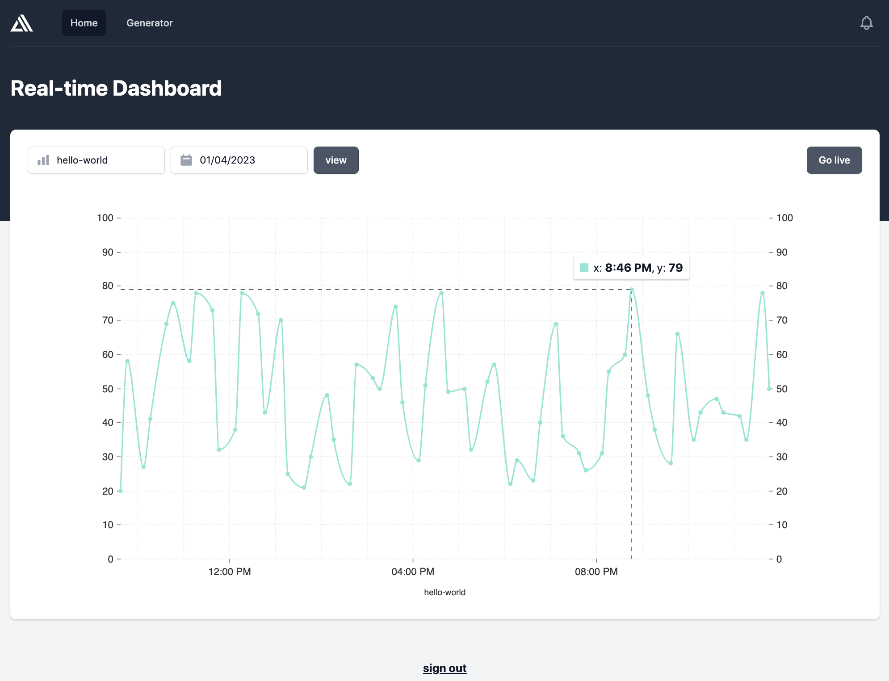
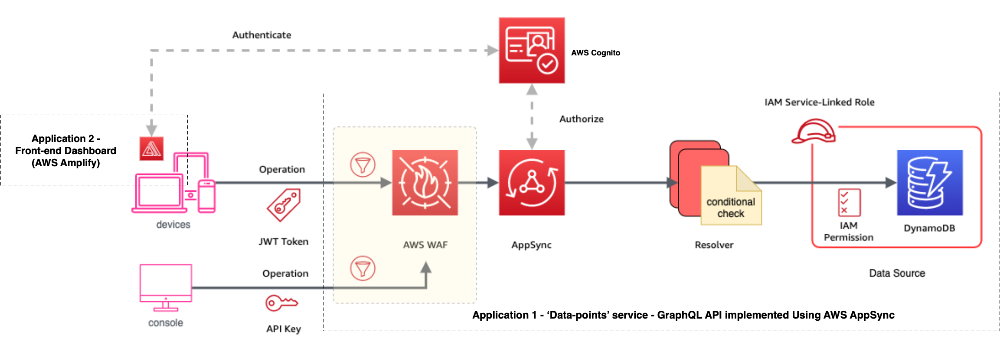
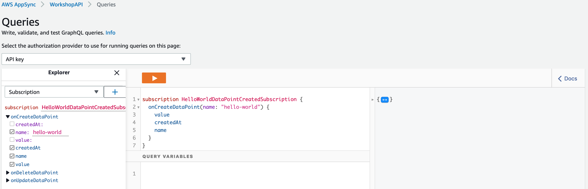
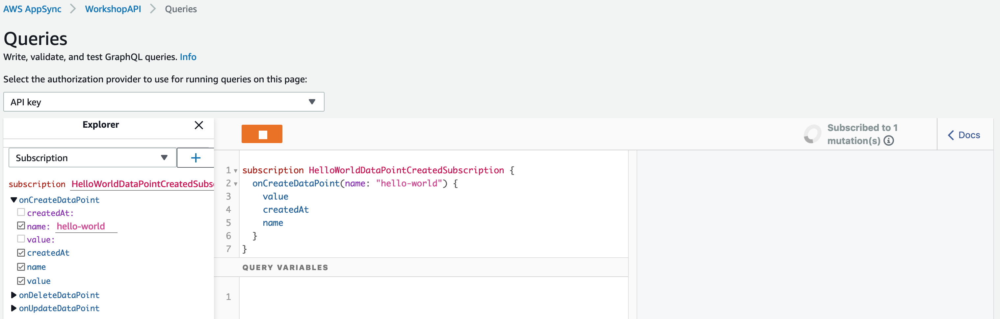
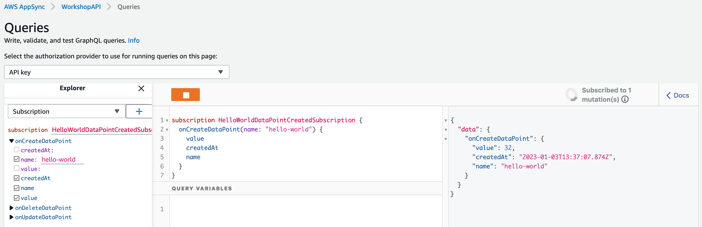
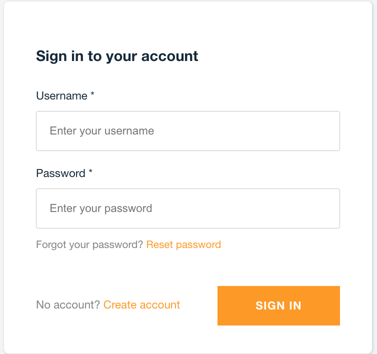
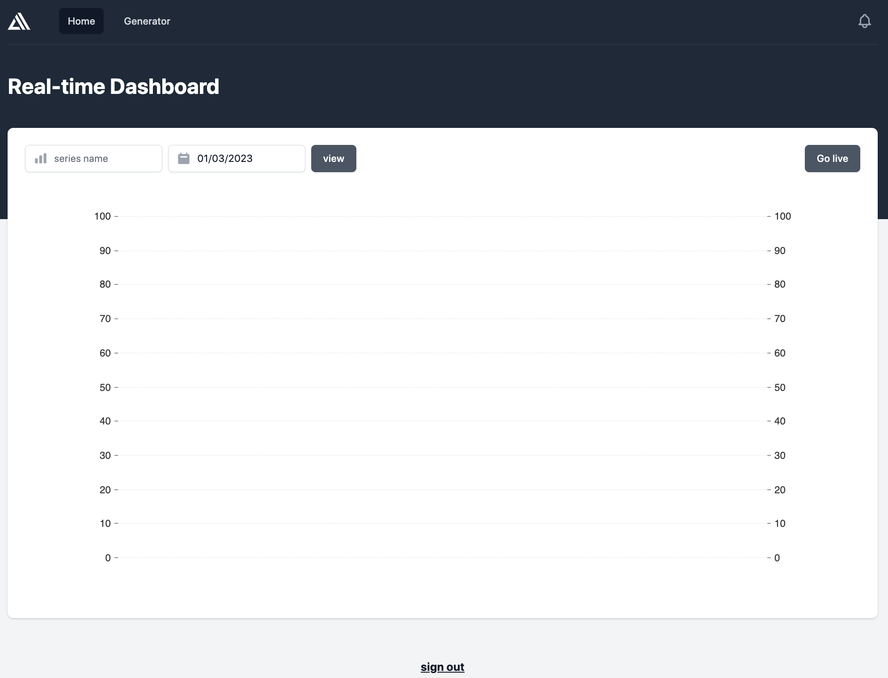
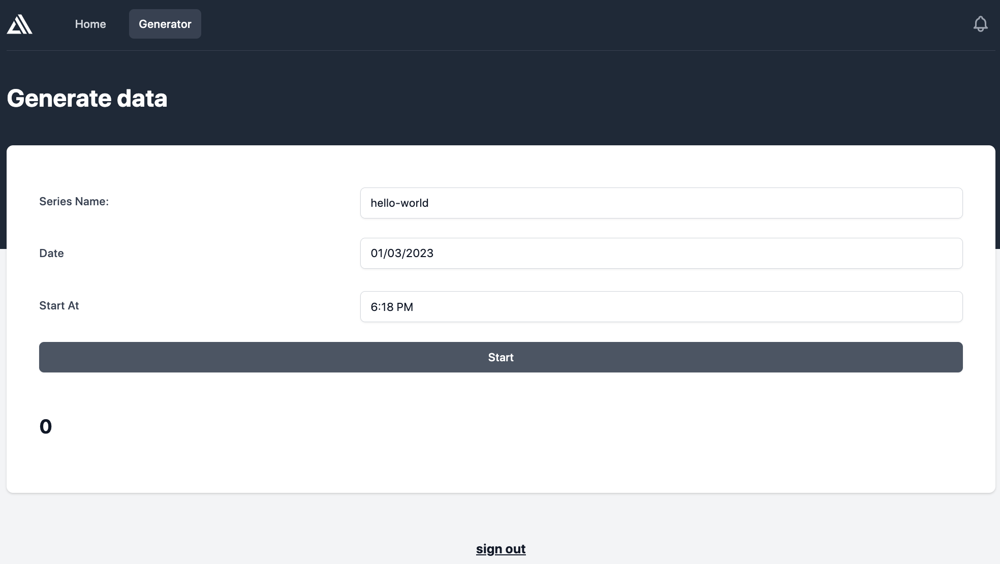
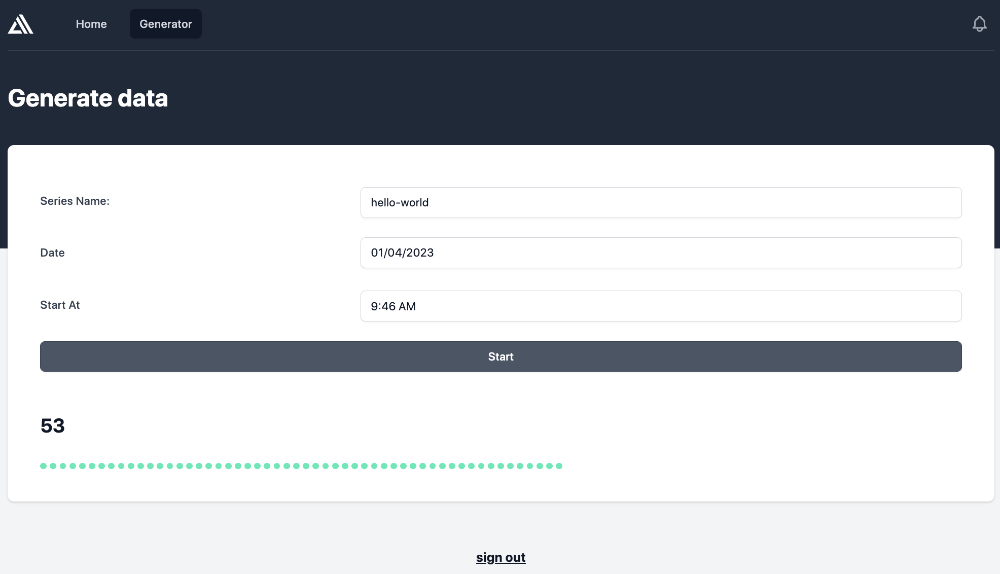
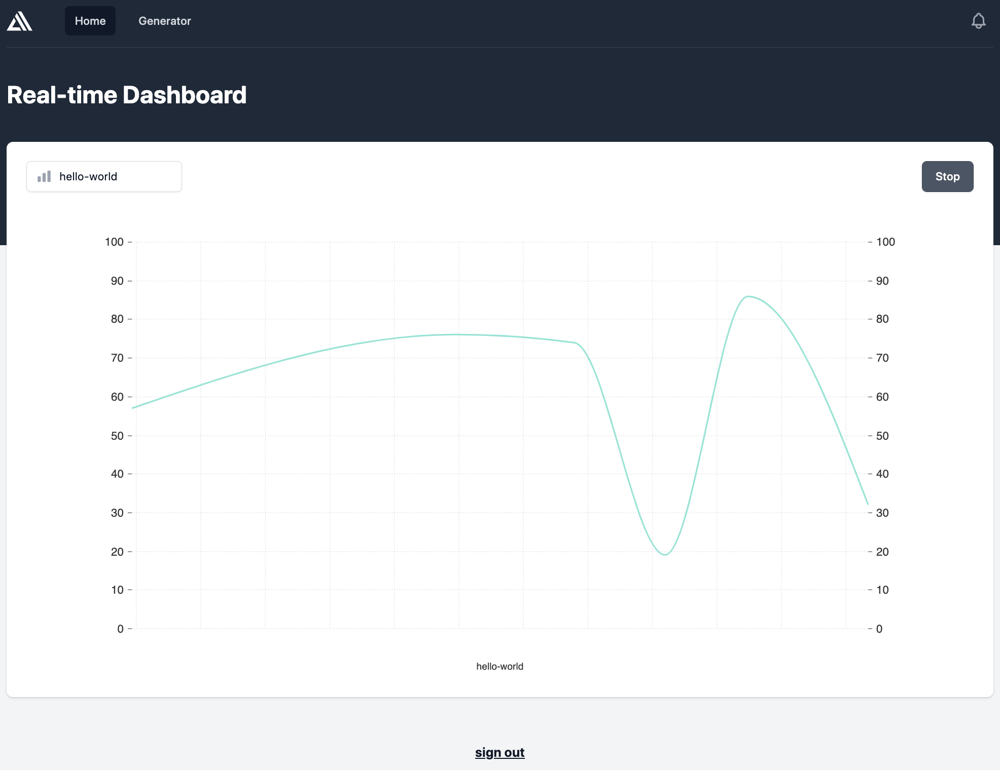

= Managing Data Points in Real-time Using a GraphQL API Deployed on AWS AppSync
:sectlinks:
:sectnums:
:sectnumlevels: 4
:toc:
:toclevels: 4

== Purpose
This repository contains a sample application that serves as an example of how to implement, secure, and automatically provision & deploy a set of GraphQL APIs using AWS AppSync.

The sample app is a simple monitoring solution that supports managing (creating, updating, deleting and querying) a named series of data-points, and displaying them in real-time on a dashboard.

However, the focus of the app is a GraphQL API which provides operations to support the creation and query of the data-points, and subscribing to  receive notification of new data-points.

Instructions are provided below for how to build, deploy and run the sample app in your own AWS account, and exercise the GraphQL APIs. For ad hoc usage this can be achieved almost entirely within the AWS free tier, although you will be charged a few cents (only).

[discrete]
=== Inspiration
The code for the sample-app (both the GraphQL API and web UI) is based on my implementation of the https://catalog.us-east-1.prod.workshops.aws/workshops/67662c95-2007-4281-ae51-5313cd7caa67/en-US['AWS AppSync immersion day workshop'] online tutorial. However, this write-up and documentation of AppSync, including the app design, implementation, development, deployment and testing is my own. I've also made some small additions, e.g. added commands for testing the GraphQL API operations, a JSON schema for documenting and validating the entity produced and consumed by the API, etc.

== About AWS AppSync
https://aws.amazon.com/appsync/[AWS AppSync] is a fully managed, serverless AWS service for building secure, scalable GraphQL APIs. AWS provide the GraphQL server and manage its operation and scaling.

AppSync supports all the typical use-cases that standard GraphQL is designed to support, including unified backend service / data-access for front-end API clients, and real-time collaboration.

AppSync supports building GraphQL APIs which source data from a variety of backend data-sources including databases managed by AWS (DynamoDB, Aurora), your own public web APIs (over HTTP), or any other AWS service (using AWS Lambda).

AppSync's key features and USPs include -

* _Serverless_ - There are no servers to manage or maintain (hence lower operational costs); pay per use; deployed across multiple data-centres (Availability Zones) out of the box for resilience, and responsive auto-scaling.

* _Caching_ - AppSync offers caching of GraphQL requests to improve performance, scalability and potentially reduce costs by avoiding round trips to query the same data from external data sources. Caches are fully managed. There is also the flexibility to cache at a fine-grained level, e.g. use different caching strategies across resolvers (data mappers) for the same GraphQL operation / API.

* _Security_ - AppSync supports multiple authentication methods for GraphQL clients including integrating with Amazon Cognito for token-based authentication, and use of API keys to support dev and test. Data access controls / permissions can be applied at a fine-grained level in relation to individual fields declared in your GraphQL schema.

* _Scalability_ - The AWS documentation states that AppSync is highly scalable. For example, there is mention of it being able to support millions of front-end clients subscribing to real-time updates.

* _Local Pub/Sub Messaging_ - In addition to the typical GraphQL use-cases mentioned above, AppSync also supports acting as a broker for pub/sub messaging between front-end clients.

== Application Design
The diagram below provides a high-level overview of the design of sample applications, their components and how they interact.

The sample app actually comprises two applications. The primary application and the main focus of this project, shown in the centre-right of the above diagram, is a backend service built using AWS AppSync, providing a GraphQL API that supports creating, retrieving and subscribing to a series of data-points.

The second application, shown on the left of the diagram, is a web-app that provides a browser-based UI for  users to register, login, generate and visualise data-points for a specified series. (This app is built using AWS Amplify).

As shown in the bottom left of the diagram, the GraphQL API can also be invoked from the AWS console (or the command line). Examples commands are provided later in this document.

=== 'Data-points' Service - GraphQL API

==== AppSync
The backend service's GraphQL API is built using and runs on AWS AppSync, which provides the GraphQL server. The API's bespoke GraphQL schema is deployed to AppSync along with other artefacts used to implement the API.

==== Resolver(s)
The data access logic required to support the service's GraphQL schema is implemented using a number of Resolvers. In GraphQL Resolvers are functions responsible for fetching the data that corresponds to fields defined in the GraphQL schema, from a supporting backend data-source (database or web API).

Resolvers can also be used to apply fine-grained authorisation / user-access controls. In the sample app, some resolvers apply 'conditional checks' to restrict users to only being able to read/write their own data-points. This is effectively business logic specific to each GraphQL API operation and its individual fields.

==== Data Source
The sample app uses AWS DynamoDB to persist the series data-points, in a single table.

AWS AppSync provides out of the box support for using DynamoDB as a data-source for GraphQL APIs, including securely integrating GraphQL resolvers. When a GraphQL API is deployed to AppSync and configured to use DynamoDB as a data-source a 'Service-Linked' AWS IAM role is created. This type of role is predefined by the AppSync service and includes all the permissions the service needs to invoke DynamoDB on the app's behalf, in this case permissions for the GraphQL resolvers to invoke the required DynamoDB persistence operations (e.g. Get, Put, Update and Delete Item, etc).

==== API Security - Authorisation of Client Requests
API clients making GraphQL requests are authenticated to support subsequently authorising their access to the data exposed in the GraphQL schema and the operations they can perform on it.

AppSync supports multiple https://docs.aws.amazon.com/appsync/latest/devguide/security-authz.html[methods for authorising] client API requests to access data/fields in the GraphQL schema, two of which are used by the sample app -

An *API key* is used to provide a convenient way to access the GraphQL API from the AWS console or command line (e.g. using curl). API keys are generated (and rotated) by the AppSync service. When a request is made the API key must be specified in x-api-key request header. AppSync doesn't provide any out of the box support for authorising requests that are authenticated using an API key. AWS therefore recommend that API keys are only used to support testing a GraphQL API, or as a means of throttling unauthenticated (public) APIs.

The front-end web-app providing the UI for viewing the data-points authorises its requests on behalf of authenticated users using AppSync's built-in support for https://docs.aws.amazon.com/cognito/latest/developerguide/cognito-user-identity-pools.html[*Amazon Cognito (User Pools)*]. Cognito provides user management services including user registration (sign-up) and management of user permissions (e.g. using roles and groups). It also supports login using the OpenID Connect (OIDC) protocol. The webapp redirects users to Cognito to authorise the app to make API requests to access the data-points on their behalf. Successful authentication results in the webapp obtaining a JWT token which it includes in its API requests (using the HTTP Bearer Authentication header). The AppSync service does the heavy lifting of integrating with Amazon Cognito to authenticate requests and expose the details of the authorised user and their claims in the GraphQL request context, where it can be used by the GraphQL API's resolvers.

==== Web-application Firewall (AWS WAF)
The AWS WAF service provides built-in support for protecting AWS AppSync hosted GraphQL against common web exploits and malicious requests that may affect their availability, compromise security, or consume excessive resources. The sample app deploys AWS WAF in front of the GraphQL API to proxy all requests. A couple of basic WAF rules are deployed to rate-limit (throttle) requests made using the API key, and also block a specified list of client IP addresses.

== Implementation Overview
This section provides an overview of how the sample app is implemented, sufficient to get started with further development and maintenance.

=== Project Folders
[%autowidth]
|===
|Folder |Purpose

|*appsync*
|*Contains the implementation of the backend service’s GraphQL API,* that is built using and runs on AWS AppSync.

|application
| Contains the implementation of the webapp that provides a dashboard for registered users to visualise the data-points for a specified series. The app is implemented in JavaScript using the https://aws.amazon.com/amplify/[AWS Amplify] library. The web-app is deployed and run locally only.

|bin
|Contains executable scripts.

Currently, there is a single Node.js script (appsync-workshop.js) that declares the *AWS CDK app* that is used to automate the provisioning and deployment of all the AWS resources that are used to support the  GraphQL API on AWS AppSync. (This script was originally generated by the AWS CDK for JavaScript's cdk init command. The cdk.json file in the repo root folder configures the AWS CDK toolkit / CLI with how to discover and execute this CDK app).

|lib
|Contains AWS CDK stacks for provisioning and deploying the AppSync GraphQL API's AWS resources, and the AWS WAF resources. The CDK stacks are implemented in JavaScript.

|===

=== AppSync GraphQL API
The implementation of the AppSync GraphQL is contained in the 'appsync' project folder.

==== GraphQL Schema
The schema for the GraphQL API can be found  in file appsync/schema.graphql. AppSync was used to generate the initial version of the schema from a supplied model of a DataPoint. The schema was then customised and extended.

===== JSON Schema for a DataPoint
The GraphQL accepts and produces JSON representations of a DataPoint. The schema for this representation is formally documented and specified by the http://json-schema.org/[JSON Schema] appsync/dataPointSchema.json. An example representation is shown below -

[source,json]
----
{
  "name":"hello-world",
  "value":91,
  "createdAt":"2022-12-29T21:51:59.946Z"
}
----

===== Summary of Supported API Operations
See the documentation for each operation in the schema for more details including supported parameters, defaults, and behaviour.

====== Queries

.Queries
[%autowidth]
|===
|Name|Description

|getDataPoint
|Retrieves a single DataPoint belonging to a named series which was created on the specified date/time.

|listDataPoints
|Retrieves a list of zero, one or more DataPoint belonging to a named series which are owned (created by) an identified user. The list can optionally be filtered to only include data-point created within a specified time-range. The list is sorted by the data-point's creation date/time. And is returned a page at a time.

|queryDataPointsByNameAndDateTime
|Queries data-points belonging to a named series, that were created within a specified time range. (Provides a more efficient way to query data-points within a time range than the list query operation). The matching point(s) are returned a page at a time, up to a specified limit.

|===

====== Mutations

.Mutations
[%autowidth]
|===
|Name|Description

|createDataPoint
|Creates a new DataPoint belonging to a named series, with a specified value.

|updateDataPoint
|Updates the value of a DataPoint identified by its series name and created date/time.

|deleteDataPoint
|Deletes a DataPoint identified by its series name and created date/time.

|===

====== Subscriptions
The table below summaries the subscription operations which the GraphQL provides to support clients receiving real-time notifications of changes to data-points. The design of these operations is constrained by the extent of  AppSync support for GraphQL subscriptions. For more details see below section <<_appsync_support_for_subscriptions>>.

.Subscriptions
[%autowidth]
|===
|Name|Description

|onCreateDataPoint
|Subscribes to receive notifications of new data-points created by a specified user (owner), via the createDataPoint mutation. The subscription can be filtered by supported parameters.

|onUpdateDataPoint
|Subscribes to receive notifications of updates to data-points made via the updateDataPoint mutation. The subscription can be filtered by supported parameters.

|onDeleteDataPoint
|Subscribes to receive notifications of the deletion of data-points made via the deleteDataPoint mutation. The subscription can be filtered by supported parameters.

|===

===== AppSync Schema Extensions
The GraphQL schema is a standard one defined by the GraphQL spec, declaring operations of type Query, Mutation and Subscription, input object types used to support variable arguments to the operations, and custom data-types for objects and fields returned by the operations.The schema does however take advantage of some useful AppSync specific extensions.

AppSync supports a small number of additional scalar types for GraphQL fields to supplement the default ones defined by the GraphQL spec. Useful ones include e.g. AWSDateTime which supports using ISO 8601 date and time strings.(For more details see the AppSync Dev Guide > Designing a GraphQL API > Designing your schema > https://docs.aws.amazon.com/appsync/latest/devguide/scalar.html#graph-ql-aws-appsync-scalars[Scalar types]).

Custom AppSync annotations are also used in the schema.They declare which of the previously mentioned supported authorisation methods are enabled, on a per operation and field basis.They also support implementing the subscription operations by associating them with the mutations which trigger data-change events.

[#_appsync_support_for_subscriptions]
===== AppSync Support for Subscriptions
The GraphQL spec supports implementing real-time push notifications using Subscription operations.They allow clients to subscribe to data-change events in the back-end using publish-subscribe  (pub-sub) messaging.Pushing data in response to events provides a more efficient and scalable (in terms of number of supportable clients) solution than API clients polling the backend for updates.And GraphQL subscription operations also support clients filtering what data-change events they want to receive for the given type of entity (domain Aggregate) using subscription operation arguments.

AppSync supports GraphQL subscriptions, including filtering, but with some limitations.Subscription operations can only be implemented for data-change events that are triggered in response to the GraphQL API's own mutation operations. You can't provide Subscription operations for data-updated by other means.In addition, another limitation is that the entity (domain Aggregate) published by a Subscription only receives the values of those fields that were provided in the triggering mutation.For example for an update operation, the published entity will only contain the subset of fields that were updated, rather than the full state of the entity.And the filter arguments a client specifies for a Subscription only match on the value _after_ the mutation.

==== Resolvers
GraphQL Resolvers are functions responsible for implementing the data access logic required to fetch and update the data that corresponds to fields defined in the GraphQL schema, from the supporting backend data-source. They're also used to apply fine-grained authorisation / user-access controls on a per-field basis.

When building GraphQL APIs using AWS AppSync, Resolvers can be implemented using either request and response mapping _templates_ or AWS Lambda functions. The sample app's GraphQL uses templates as they are simpler and cheaper to use  when integrating with AWS managed data-sources supported by AWS AppSync such as DynamoDB.

The implementation of the data-point backend service's GraphQL API Resolvers can be found in the *appsync/resolvers* subfolder.

The https://docs.aws.amazon.com/appsync/latest/devguide/resolver-mapping-template-reference-overview.html[Resolver mapping templates] are implemented using the Apache Velocity Template Language (VTL) and contain the necessary transformation and execution logic to adapt the request and response to and from the type of backend data-source (DynamoDB) in which the data corresponding to the schema fields are stored.

There is an implementation of an AppSync https://docs.aws.amazon.com/appsync/latest/devguide/resolver-mapping-template-reference-overview.html#unit-resolvers[Unit Resolver] for each of the Query and Mutation operations defined in the API's GraphQL schema. At minimum each Unit Resolver consists of a _request_ mapping template that is responsible for validating the GraphQL API request, extracting its arguments and mapping it to the corresponding DynamoDB persistence operation (e.g. GetItem, Query, etc.) to be executed by AppSync. For some Query and Mutation operations the Unit Resolver also includes a _response_ mapping template, when there is a need to apply some custom post-processing (e.g. filtering) of GraphQL response which AppSync generates from the DynamoDB result, before returning it to the GraphQL client.

The API's Subscription operations are in most cases fully implemented by AppSync by out-of-the-box, and therefore don't have any custom Resolver logic. However, in some cases a _response_ mapping template is needed to customise (e.g. filter) the generated GraphQL response.

For additional help and support understanding the implementation of the Resolvers, consult the AWS AppSync Dev Guide, section https://docs.aws.amazon.com/appsync/latest/devguide/resolver-mapping-template-reference.html[Resolver mapping template reference (VTL)], including subsection https://docs.aws.amazon.com/appsync/latest/devguide/resolver-mapping-template-reference-dynamodb.html[Resolver mapping template reference for DynamoDB].

== Setup Local Dev Environment
This section contains instructions for how to install and configure the software required to support building, deploying and running the sample-app - primarily the aforementioned data-point GraphQL API, and also its web UI.

=== Git
You will need to install Git to support checking-out (cloning) a copy of the code in this repository.

=== Node.js
Node.js needs to be locally installed to support building and deploying the AWS Cloud Development Kit (CDK) app that is used to automate provisioning and deployment of the GraphQL API to AWS AppSync. Node is also needed to support deploying and running the web-app that provides a dashboard for displaying the metrics.

Install the latest release of Node.js *16.x*. (Whilst later versions of Node.js may work, these have _not_ been tested).

The simplest and most flexible way to install and manage the required version of Node  (and any other versions of Node you may use) is to use a node version manager, such as https://github.com/nvm-sh/nvm[nvm], by following the instructions documented in the https://github.com/nvm-sh/nvm#installing-and-updating[Installing and Updating section of the ] project's README. For example -

[source,shell]
----
$ curl -o- https://raw.githubusercontent.com/nvm-sh/nvm/v0.39.3/install.sh | bash
$ source .bash_profile
$ nvm install 16
----

Following the installation, ensure the current version of Node.js is 16.x, e.g.
[source,shell]
----
$ node -v
v16.19.0
----

=== AWS CDK
The AWS Cloud Development Kit (CDK) is used to automate the reliable, repeat provisioning of the GraphQL API to AppSync, along with its associated AWS resources (e.g.  DynamoDB table).  (The CDK app and its stacks are implemented in JavaScript).

Install the latest release of the AWS CDK *1.x* for JavaScript. Use the Node Package Manager (npm) client which was included in the installation of Node.js. For example -

[source,shell]
----
$ npm install -g aws-cdk@1.140.0
----

=== AWS API Credentials
The AWS CDK app that's used to provision and deploy the AppSync GraphQL API relies on making AWS API requests on behalf of an AWS IAM user with Administrator permissions in your AWS account.

[discrete]
==== Create IAM User with API Credentials
First create an IAM user in your AWS account with Administrator permissions, and an active set of permanent AWS API credentials (Access Key ID and Secret Access Key). If you already have such an existing AWS IAM User then you can use that. (However, inline with AWS security best practices, it is recommended you do _not_ use the root user for your AWS account. Create a dedicated, non-root IAM user instead). Otherwise, the simplest way to create the IAM user and credentials is via the AWS management console.

[discrete]
==== Configure AWS Credentials Profile
The AWS CDK app is configured by default to source its AWS credentials from a locally configured profile named 'appsync-workshop'. (You can use a credentials profile of a different name if you wish, but you will need to remember to additionally specify it using --profile option when running the provided CDK commands documented below)

Locally create this named AWS credentials profile and configure it with the set of AWS credentials you created for your AWS IAM user in the previous section. The credentials profile is also used to configure the AWS region in which the GraphQL API and its associated AWS resources will be created. Create and configure the credentials profile using the following AWS CLI command -

[source,shell]
----
$ aws configure --profile appsync-workshop
----
For example -
----
AWS Access Key ID [None]: <enter-your-AWS-Access-key-ID>
AWS Secret Access Key [None]: <enter-your-AWS-Secrete-Access-key>
Default region name [None]: <enter-your-chosen-AWS-region-eg-eu-west-1>
Default output format [None]: json
----

=== jq - Command line JSON parser
The https://stedolan.github.io/jq/[jq utility] is used to parse and format JSON on the command line.

The CloudFormation stack for the GraphQL API includes a set of environment-specific output values for the deployed resources. When the stack is produced and deployed by the AWS CDK app these  are output to the console in JSON format. The jq utility] is used to parse the CDK app console output and extract the values, so they can be used in subsequent commands, e.g. invoking the GraphQL API from the command line.

jq is also used to format (pretty-print) responses returned by the GraphQL API when requests are made from the command line.

Download and install the jq utility using one of its documented methods for your supported O/S. For example, on Mac, use the Homebrew package manager -
[source,shell]
----
$ brew install jq

----

[#_deploy_the_data_points_graphql_api_to_aws_appsync]
== Deploy the Data-points GraphQL API to AWS AppSync
This repo includes an AWS CDK app which declares a CloudFormation stack that automates the process of deploying the sample app's GraphQL API to AWS AppSync, including provisioning all the supporting AWS resources.The steps to deploy the GraphQL API are outlined below.

*1) Checkout a copy of this repo to your local workspace* -
Checkout (clone) a copy of the code in this Git repo, e.g.
[source,shell]
----
$ cd ~/
$ git clone https://github.com/neiljbrown/appsync-workshop
----

**2) Bootstrap the AWS CDK in your AWS account ** -
Before deploying this (and any other) AWS CDK app for the first time, you need to bootstrap the CDK for the given environment (as defined by the AWS account and region), as follows -

2.1) Change directory to the root folder of the project's repo in which the CDK app is contained -
[source,shell]
----
$ cd ~/appsync-workshop
----

2.2) Use the ‘cdk bootstrap’ command to install the CDK’s bootstrap stack into the CDK app's configured environment. The environment is derived from the AWS credentials profile which is used when executing the cdk command, which as previously explained has been configured in the CDK project (specifically the cdk.json file) to default to a profile named appsync-workshop.
[source,shell]
----
$ cdk bootstrap
----
The created bootstrap stack includes resources that are needed for the CDK toolkit’s operation e.g. an S3 bucket that is used to store templates and assets during the deployment process.

**3) Deploy the GraphQL API and support AWS resources ** -
Use the following cdk command to provision and deploy the AppSync GraphQL API and supporting resources for other AWS services (e.g. the DynamoDB table that is used to store the data-point metrics) to your AWS environment (account and region). This command generates (synthesizes) a CloudFormation stack from its declaration in the CDK app, and deploys it to CloudFormation service.

[source,shell]
----
$ cdk deploy --output output.json
----

If you want to see what will be deployed before executing the above command, enter the following cdk command. This will generate the CloudFormation stack from the CDK app's declared stack and output it to the console without deploying it
[source,shell]
----
$ cdk synth
----

The cdk deploy command will take a minute or so to complete while all the AWS resources are deployed. The progress will be displayed by events written to your console. When the command completes successfully the last thing written to the console will be output variables declared in the CloudFormation stack. These contain the values of generated resources which will be subsequently needed to invoke the API, e.g.
[source,shell]
----
...
...
Outputs:
AppsyncWorkshopStack.GRAPHQLAPIID = <generated-appsync-graphql-api-id>
AppsyncWorkshopStack.GRAPHQLAPIKEY = <generated-appsync-graphql-api-key>
AppsyncWorkshopStack.GRAPHQLAPIURL = <generated-appsync-graphql-api-url>
AppsyncWorkshopStack.STACKREGION = <aws-region-to-which-stack-deployed>
AppsyncWorkshopStack.USERPOOLSID = <generated-cognito-user-pool-id>
AppsyncWorkshopStack.USERPOOLSWEBCLIENTID = <generated-cognito-web-client-id-for-web-app>
Stack ARN:
arn:aws:cloudformation:<AWS-region>>:<AWS-account-ID>:stack/AppsyncWorkshopStack/<generated-cloudformation-stack-id>

✨  Total time: 90.08s
----

== Exploring and Using the Data-points GraphQL API
This section explains how to explore the data-points GraphQL API, and use (invoke) its operations, including examples.

Two sets of tools are used - a standard (command line) HTTP client, and a GraphQL web UI / console.

https://github.com/graphql/graphiql/[GraphiQL] is a browser-based client for exploring and invoking GraphQL APIs, which is developed as part of the official GraphQL project. It is an excellent tool for exploring and understanding GraphQL APIs, and executing ad hoc GraphQL requests using its interactive support for building and auto-completing such requests. AWS AppSync provides an equivalent hosted version of the tool which is accessible via the AppSync web console. This supports authenticating API requests using either the AppSync provisioned API key, or on behalf of a registered (Cognito) user. Therefore, rather than separately install a copy of GraphiQL, we will use the AppSync web console, specifically to demonstrate the data-point GraphQL API's subscription operations, which clients would use to receive notifications of changes made via the API, in real-time.

=== Executing Queries and Mutations Using a Command Line HTTP Client
Whilst GraphiQL (and the AppSync web console) are great, GraphQL Query and Mutation operations can just as easily be invoked using a general-purpose HTTP client. This section provides examples of using a command line HTTP client (curl) to invoke the data-point's GraphQL Query and Mutation operations, authenticating the API requests using the AppSync provisioned API key. (Note that AppSync doesn't support applying authorisation rules when using this method authentication, therefore it is only intended to be used to support development and testing, and not for use in production).

Example curl commands for executing each of the API's operations are provided below. As is the case for all GraphQL APIs, a POST request is made to the API's single endpoint with the operation and requested fields specified in the request body.

[discrete]
==== Extract GraphQL API URL and Key
Extract the generated, environment specific request URL and API key for the GraphQL API from the values that were output when the app's stack was deployed by the CDK -
[source,shell]
----
$ API_KEY=`jq -r .AppsyncWorkshopStack.GRAPHQLAPIKEY output.json`
$ API_URL=`jq -r .AppsyncWorkshopStack.GRAPHQLAPIURL output.json`
----

[#_mutation__create_data_point]
==== Mutation - Create Data-point
Create a new DataPoint belonging to a named series, with a specified value -

[discrete]
===== Example API Request
The following is an example of a valid request which outputs the full API response, including headers as well as the body.
[source,shell]
----
$ MUTATION='mutation create($input: CreateDataPointInput!) { createDataPoint(input: $input) { createdAt name value } }'

$ VARIABLES='{"input":{"name":"hello-world","value":'$(($RANDOM % 100))'}}'

$ curl --include -XPOST \
-H "Content-Type:application/graphql" \
-H "x-api-key:$API_KEY" \
-d '{"query": "'"$MUTATION"'","variables": '$VARIABLES'}' \
$API_URL
----

If you only want to see a nicely formatted (pretty-printed) JSON response body use the following alternative curl command (replace --include with --silent and pipe the output to the jq utility) -

[source,shell]
----
$ curl --silent -XPOST \
-H "Content-Type:application/graphql" \
-H "x-api-key:$API_KEY" \
-d '{"query": "'"$MUTATION"'","variables": '$VARIABLES'}' \
$API_URL |  jq
----

[discrete]
===== Example API Success response
[source,shell]
----
HTTP/2 200
content-type: application/json;charset=UTF-8
content-length: 101
date: ...
x-amzn-requestid: 074e0583-4051-4c58-89aa-f1a55af6e6d3
x-amzn-appsync-tokensconsumed: 1
x-cache: Miss from cloudfront
via: 1.1 a93ae2d...a.cloudfront.net (CloudFront)
x-amz-cf-pop: LHR50-P6
x-amz-cf-id: FdAS...Hw==

{
  "data": {
    "createDataPoint": {
      "createdAt": "2023-01-02T12:55:51.263Z",
      "name": "hello-world",
      "value": 51
    }
  }
}
----

==== Mutation - Update Data-point
Updates the value of a DataPoint identified by its series name and created date/time.

[discrete]
===== Example API Request
The following example request updates the value of the data-point created by the previous request above -
[source,shell]
----
$ MUTATION='mutation update($input: UpdateDataPointInput!) { updateDataPoint(input: $input) { createdAt name value } }'

$ VARIABLES='{"input":{"name":"hello-world","createdAt":"2023-01-02T12:55:51.263Z","value":'$(($RANDOM % 100))'}}'

$ curl --silent -XPOST \
-H "Content-Type:application/graphql" \
-H "x-api-key:$API_KEY" \
-d '{"query": "'"$MUTATION"'","variables": '$VARIABLES'}' \
$API_URL |  jq
----

[discrete]
===== Example API Success response
[source,json]
----
{
  "data": {
    "updateDataPoint": {
      "createdAt":"2023-01-02T12:55:51.263Z",
      "name":"hello-world",
      "value":64
    }
  }
}
----

==== Query - Get Data-point
Retrieves a single DataPoint belonging to a named series which was created on the specified date/time.

[discrete]
===== Example API Request
The following example request queries the value of the data-point updated by the previous request above -

[source,shell]
----
$ QUERY='query get($name: ID!, $createdAt: AWSDateTime!) { getDataPoint(name: $name, createdAt: $createdAt) { createdAt name value } }'

$ VARIABLES='{"name":"hello-world","createdAt":"2023-01-02T12:55:51.263Z"}'

$ curl --silent -XPOST \
-H "Content-Type:application/graphql" \
-H "x-api-key:$API_KEY" \
-d '{"query": "'"$QUERY"'","variables": '$VARIABLES'}' \
$API_URL | jq
----

[discrete]
===== Example API Success response
[source,json]
----
{
  "data": {
    "getDataPoint": {
      "createdAt":"2023-01-02T12:55:51.263Z",
      "name":"hello-world",
      "value":64
    }
  }
}
----

==== Query - List Data-points
Retrieves a list of zero, one or more DataPoints belonging to a named series. The list can optionally be filtered to only include data-points created within a specified time-range. The list is sorted by the data-point's creation date/time, and is returned a page at a time.

[discrete]
===== Example API Request
The following example request queries the value of all existing data-points in the 'hello-world' series. (In this example command, the body of the GraphQL request is read from file rather than specified on the command line using environment variables, in order to avoid the need to escape quotes in its query and variables fields).

[source,shell]
----
$ curl --silent -XPOST \
-H "Content-Type:application/graphql" \
-H "x-api-key:$API_KEY" \
--data-binary "@gql-request.json" \
$API_URL | jq
----
where the file gql-request.json contains the following GraphQL request body -
[source,json]
----
{
  "query": "query listDataPoints($filter: TableDataPointFilterInput!) { listDataPoints(filter: $filter)  { items { createdAt name value } }}",
  "variables": {
    "filter": {
      "name": {
        "eq": "hello-world"
      }
    }
  }
}
----

[discrete]
===== Example API Success response
[source,json]
----
{
  "data": {
    "listDataPoints": {
      "items": [
        {
          "createdAt": "2022-12-30T18:40:15.681Z",
          "name": "hello-world",
          "value": 10
        },
        {
          "createdAt": "2023-01-02T12:55:51.263Z",
          "name": "hello-world",
          "value": 64
        },
        {
          "createdAt": "2023-01-02T13:11:05.594Z",
          "name": "hello-world",
          "value": 87
        }
      ]
    }
  }
}
----

==== Query - Query Data Points By Name and DateTime
Queries data-points belonging to a named series, that were created within a specified time range. The matching point(s) are returned a page at a time, up to a specified limit. The data-points can optionally be filtered by the data-point creation date using a standard set of operators.

[discrete]
===== Example API Request
The following example request queries all the data-points in the 'hello-world' series that were created today (if any), and returns them is descending created date/time (most recent first) order.

[source,shell]
----
$ QUERY='query MyQuery($name: ID!, $createdAt: ModelStringKeyConditionInput) { queryDataPointsByNameAndDateTime(name: $name, createdAt: $createdAt, sortDirection: DESC) { items { createdAt name value } } }'

$ VARIABLES='{"name":"hello-world","createdAt":{"beginsWith":"'`date +%G`'"}}'

$ curl --silent -XPOST \
-H "Content-Type:application/graphql" \
-H "x-api-key:$API_KEY" \
-d '{"query": "'"$QUERY"'","variables": '$VARIABLES'}' $API_URL | jq

----

[discrete]
===== Example API Success response
[source,json]
----
{
  "data": {
    "queryDataPointsByNameAndDateTime": {
      "items": [
        {
          "createdAt": "2023-01-02T13:11:05.594Z",
          "name": "hello-world",
          "value": 87
        },
        {
          "createdAt": "2023-01-02T12:55:51.263Z",
          "name": "hello-world",
          "value": 64
        }
      ]
    }
  }
}
----

==== Mutation - Delete Data-point
Deletes a DataPoint identified by its series name and created date/time.

[discrete]
===== Example API Request
The following example request deletes the data-point created above, identified by series name and created date/time -
[source,shell]
----
MUTATION='mutation delete($input: DeleteDataPointInput!) { deleteDataPoint(input: $input) { value }}'

$ VARIABLES='{"input":{"name":"hello-world","createdAt":"2022-12-29T21:51:59.946Z"}}'

$ curl --include -XPOST \
-H "Content-Type:application/graphql" \
-H "x-api-key:$API_KEY" \
-d '{"query": "'"$MUTATION"'","variables": '$VARIABLES'}' $API_URL
----

[discrete]
===== Example API Success response
[source,shell]
----
HTTP/2 200
content-type: application/json;charset=UTF-8
content-length: 33
...
...
{
  "data": {
    "deleteDataPoint":null
  }
}
----

=== Invoking the GraphQL API's Subscription Operations
Using the real-time subscription operations of the GraphQL API (independently of the web-app) requires a WebSocket client. As mentioned in the introduction to this section, AppSync provides an equivalent hosted version of GraphiQL web client in the AppSync web console, which supports exploring the GraphQL schema, and interactively building and submitting GraphQL API requests, including subscriptions. We will therefore use the AppSync console to demonstrate ad-hoc manual (interactive) testing of the Data-point GraphQL API's subscription operations.

==== Subscribe to Real-time Updates for New DataPoints

This subsection describes how to test receiving real-time notifications for new data-points, for a specific, named data-series, using the GraphQL's onCreateDataPoint subscription operation.  The ability to selectively subscribe to receive notifications for a specific data-series only is made possible by AppSync's support for *parameterised GraphQL subscriptions*. Clients can create subscriptions to data-change events which are only reported if a property of the entity state matches a specified value exposed as a subscription operation parameter.

*1) Step 1* - Login to the AWS AppSync console, and from the 'API' page select the previously deployed GraphQL API named 'WorkshopAPI'.

Then select the 'Queries' side-menu to navigate to the console page that supports writing, validating, and test any of the API's GraphQL operations (mutations and subscriptions, as well as queries)

*2) Step 2* - Use the console's Queries page to create an AppSync subscription to receive notifications of newly created data-points, in real-time.

*2.1)* First use the console page to construct a request to the GraphQL API's onCreateDataPoint operation, as follows

* Use the 'authorization provider' drop-down at the top of the page to select the method for authenticating and authorising the request to 'API key' (rather than 'Amazon Cognito User Pool') from

* Author the subscription request. You can use the console's support for doing this, by using the 'Explorer' section in the left-hand-side of the page, selecting 'Subscription' from the drop-down and click the '+' button. Alternatively, just cut and paste the following GraphQL request body in the central request editor box -

[source,graphql]
----
subscription HelloWorldDataPointCreatedSubscription {
  onCreateDataPoint(name: "hello-world")
}
----

On completion of the above steps, the Queries console page should look similar to the following -

*2.2)* Submit the subscription request by clicking the play button displayed above the GraphQL editor on the Queries page. If the subscription is successful the console page will be updated to display the message "Subscribed to 1 mutation(s)",  e.g.

*3) Step 3* - Use the GraphQL API's createDataPoint operation to create one or more new data-points in the 'hello-world' series for which the subscription was created. An example curl command for making the necessary GraphQL API request can be found in above section <<Mutation - Create Data-point>>.

*4) Step 4* - If the GraphQL API and AppSync are working as expected, you should see AppSync publish a GraphQL response for each data-point you create, in the right-hand section of the console page, in real-time, e.g. -

*5) Step 5* - To finish, delete your subscription by clicking the stop button displayed   above the GraphQL editor on the Queries page.

== Deploying and Using the DataPoints Web UI
As previously described above, this repo also includes a web-app. The web-ap provides a browser-based web UI supporting the following features -

* User registration (sign-up) and login (sign-in).

* Generating a set of data-points with random values for a named series, on a specified date. This feature uses the GraphQL API's createDataPoint operation.

* Displaying a graph of historic data-points for a specified data-series on a specified day. This feature uses the GraphQL API's queryDataPointsByNameAndDateTime operation.

* Graphing new data-points in real-time, as they're created. This feature uses the GraphQL API's onCreateDataPoint subscription operation.

This section describes how to configure, deploy and run the web-app, and access and use the aforementioned features.

=== Web-App Implementation & Deployment Overview
As previously described in the <<Implementation Overview>> section above, the web-app is implemented in JavaScript using the AWS Amplify library. The code is contained in the 'application' folder of this repository.

The web-app integrates with AWS Cognito which provides the backend for the user registration (sign-up) and login (sign-in) functions. The previously deployed CDK stack created a Cognito User Pool for the whole app and a client ID for the web-app. The web-app authenticates itself with Cognito on behalf of the authenticated user, using the OpenID Connect (OIDC) protocol, and uses the resulting credentials (tokens) to authenticate itself with AppSync when making GraphQL API requests (on behalf of the user).

For the purposes of this exercise, the web-app is deployed and run locally in your dev environment.

=== Configure AWS Integration Details
The web-app integrates with both the AWS Cognito service (to support user management) and AWS AppSync service (for GraphQL API operations). This section describes how to configure the web-app with details of how to connect to these services in your AWS account and region, and with the identities of application and environment specific resources which were previously provisioned for each service by the CDK app.

You should have already checked-out / cloned a  copy of this repository, including the web-app's source code, as part of completing the steps in above section <<_deploy_the_data_points_graphql_api_to_aws_appsync>>.

1) Open the web-app config file `application/src/aws-exports.js` in a text-editor.

2) Replace the tokenised values for the following fields/properties of the 'awsmobile' configuration object with the corresponding values which were output to the console when the CDK app was used to deploy the app's CloudFormation stack (as per the steps in the  <<_deploy_the_data_points_graphql_api_to_aws_appsync>> section)

* `aws_appsync_graphqlEndpoint` - Set to the value of the CDK stack's output variable AppsyncWorkshopStack.GRAPHQLAPIURL.

* `aws_appsync_region` - Set to the value of the CDK stack's output variable AppsyncWorkshopStack.STACKREGION.

* `aws_cognito_region` - Set to the value of the CDK stack's output variable AppsyncWorkshopStack.STACKREGION.

* `aws_user_pools_id` - Set to the value of the CDK stack's output variable AppsyncWorkshopStack.USERPOOLSID

* `aws_user_pools_web_client_id` - Set to the value of the CDK stack's output variable AppsyncWorkshopStack.USERPOOLSWEBCLIENTID.

=== Download and Install Web-App Dependencies
The Amplify web-app source code has a number of dependencies which need to be installed locally using the following steps -

1) Open a terminal session and change to the directory containing the web-app source code e.g.
[source,bash]
----
$ cd ~/appsync-workshop/application
----

2) Run the following Node Package Manager (npm) command -
[source,bash]
----
$ npm install
----

=== Build and Launch the Web-App Locally
Build the web-app and start it up locally in your dev environment, by entering the following npm command in the same terminal session and current directory used in the previous step -
[source,bash]
----
$ npm run start
----

If the command completes successfully a development web-server will be started, and a new browser tab will be automatically launched at URL http://localhost:3000, which will display the app's (standard Cognito) registration (sign-up) and login (sign-in) page, e.g.

=== Register a User and Login
Use the 'Create account' link at the bottom of the displayed Sign-in page to create a user account for the web-app. (This will create an account / register a user in the app's configured Cognito User Pool).

Now use the Sign-in page to log-in as the newly registered user - enter the user's credentials (username and password) and click the 'SIGN IN' button.

If the login is successful the home page of the web-app will be displayed as shown below -

=== Generate a Series of Data-Points
The web-app can be used to generate a set of data-points with random values for a named series, on a specified date. (This feature uses the GraphQL API’s createDataPoint operation).

1) Click the 'Generator' link in the top-left of the web UI. This should result in the 'Generate data' page being displayed as shown below -

2) As shown in the screenshot above, the page comprises a form for specifying the name of the series and the date/time from after which the new data-points should be generated. When the form is first displayed these default to series 'hello-world' and the current date/time. Accept the default values, or adjust them as you wish.

3) Click the 'Start' button to start generating data-points with random values. The page will be updated with a count of the number of data-points which have been generated. Click 'Stop' after a few seconds, when enough points have been generated -

=== Visualise a Series of Data-Points
You can also use the web UI to display a graph of historic data-points for a specified data-series on a specified day. (This feature uses the GraphQL API’s queryDataPointsByNameAndDateTime operation).

1) Click the 'Home' link in the top-left of the web UI to return to the app's home ('Real-time Dashboard') page.

2) Use the 'series name' text-box in the upper-left of the page to enter the name of the data-series you used to generate the data-points in the previous section, e.g. 'hello-world'. And select the day for which the data-points should be displayed from the date-picker alongside. (This initially defaults to today's date).

3) Click the 'view' button. This will result in all of data-points for the matching series, created on the specified day being plotted as graph on the page, with x-axis being the date/time of the data-points and y-axis being their value. You can use mouse to display the x and y values of each data-point, e.g.

=== Display Newly Created Data-Points in Real-Time
The web UI also supports graphing new data-points in real-time, as they're created. (This feature uses the GraphQL API's onCreateDataPoint subscription operation).

1) On the web-app home-page ('Real-time Dashboard') enter the name of the series for the data-points you wish to monitor in real-time in the text-box in the upper-left of the page, or accept the default name 'hello-world'.

2) Click the 'Go live' button in the upper-right side of the page. This will result in the web-app making a request to the GraphQL API to subscribe to receive notifications of newly created data-points with a matching series. You will just see the page re-displayed with the series name set and the 'Go live' button replaced by a 'Stop' (subscription) button.

3) Generate a few data-points with a matching series for today (e.g. with a default date/time of now). You can achieve this by repeatedly executing the curl command documented in section <<_mutation__create_data_point>>, remembering to change the random value of the data-point before each execution of the command.

After you've generated the second data-point you should start to see the new points being plotted on the page in near real-time, e.g.

Pretty cool, eh? This illustrates the kind of real-time use-cases which GraphQL can support (with AppSync supporting running a serverless implementation of the GraphQL sever/engine and your API).

4) Click the 'Stop' button to (unsubscribe and) stop displaying new data-points.

== Clean-up
Before finishing with this project and moving on, follow the steps below to clean up the AWS resources and data which were created, if only to avoid being billed in the future.

=== Destroy App's CloudFormation Stack
Delete some of the resources that were created for various AWS services (AppSync, Cognito etc.) by destroying the stack that was deployed by the CDK app, as follows

1) Open a terminal session and change to the root directory for the app, e.g.
[source,bash]
----
$ cd ~/appsync-workshop
----

2) Enter the following command
[source,bash]
----
$ cdk destroy
----

End.